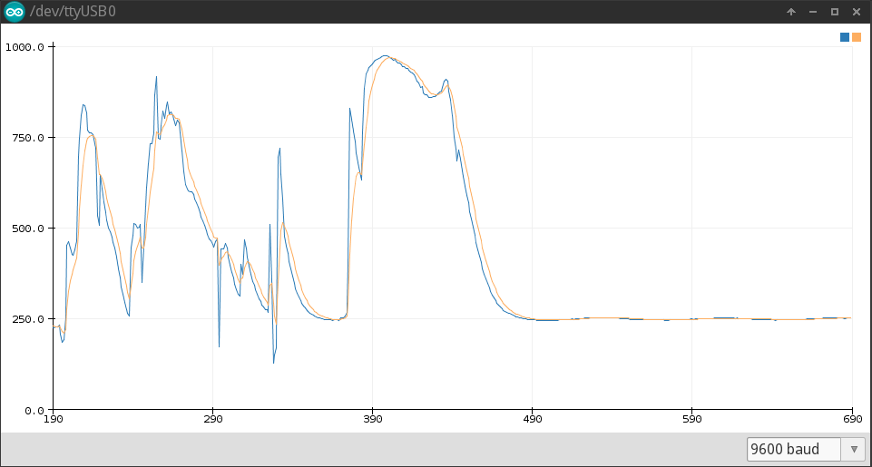

# ExpSmooth
Exponential smoothing for Arduino, using only integers.

The ExpSmooth library has been designed to use only integers, additions, substractions and bit shifts for an exponential smoothing filter.

## 

The smoothing function.

```
y0 = x
y = (1-a)y + ax
```

Various values for `a` are implemented in several methods:

| method | a
| ------ | ------
| calc06 | 0.0625
| calc12 | 0.125
| calc25 | 0.25
| calc50 | 0.5
| calc75 | 0.75
| calc88 | 0.875
| calc94 | 0.9375

## Example

```
#include "ExpSmooth.h"

ExpSmooth ExpSmth;

void setup() {
  Serial.begin(9600);
  int y = analogRead(A0);
  ExpSmth.setInitial(y);
}

void loop() {
  int y = analogRead(A0);
  int z = ExpSmth.calc25(y);
  Serial.print(y);
  Serial.print(",");
  Serial.print(z);
  Serial.println();
  delay(200);
}
```




## Reference

https://en.wikipedia.org/wiki/Exponential_smoothing
